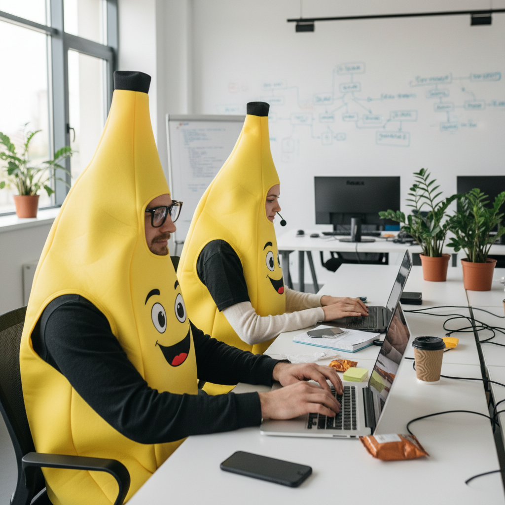

# Google Colab ではじめる Gemini API、今話題の画像生成 AI モデル「Nano Banana」を試してみましょう。

「テキストから、あっという間にすごいクオリティの画像が作れたら…」
「写真の一部だけを、まるで魔法のように自然に修正したい…」

そんな願いを叶える、Google の最新画像生成 AI モデル、通称「Nano Banana」こと `gemini-2.5-flash-image-preview` が登場しました。

この記事では、その機能と使い方を、ハンズオン形式で学びます。[「Google Colab」](https://colab.research.google.com/) を使って、サンプルコードを実行しながら進めるので、誰でも簡単に最新の画像生成 AI を体験できます。


以下のボタンから Notebook を開いて進めましょう。

[](https://colab.research.google.com/github/kkitase/gemini-2.5-findy/blob/main/notebooks/03-jp-nano-banana.ipynb)

以降の解説は、Google Colab で実際にコードを実行しながら進めることを想定していますが、コードと解説を読み進めるだけでも学習できます。

## **重要**
- [セットアップと認証](https://colab.research.google.com/github/kkitase/gemini-2.5-findy/blob/main/notebooks/00-jp-setup-and-authentication.ipynb) のセクションを完了し、`GEMINI_API_KEY` の設定が済んでいることを確認してください。
- もしエラーが出たら、[Gemini in Google Colab](https://colab.research.google.com/github/kkitase/gemini-2.5-findy/blob/main/notebooks/00-jp-setup-and-authentication.ipynb#scrollTo=7d140654) を使い、コードの説明やデバッグをして解決を試みてください。
- 生成されたすべての画像には、信頼性検証のために SynthID ウォーターマークが含まれています。詳細は[公式ドキュメント](https://ai.google.dev/gemini-api/docs/image-generation?hl=ja) をご覧ください。
- データの取り扱い方については、[Google による使用者のデータの利用方法](https://ai.google.dev/gemini-api/terms?hl=ja#data-use-unpaid) を必ずお読みください。
- 企業での利用や、より高度なプライバシー保護が必要な場合は、有料の Google Cloud の Vertex AI をご検討ください。


### 学習のためのリポジトリをクローンします
```python
!git clone https://github.com/kkitase/gemini-2.5-findy.git
%cd gemini-2.5-findy
```


## 1. Nano Banana (`gemini-2.5-flash-image-preview`) とは？

`gemini-2.5-flash-image-preview` は、Google が開発した最先端の画像生成・編集モデルです。テキストで指示するだけで高品質な画像を生成するだけでなく、既存の画像とテキストを組み合わせて、特定の部分だけを編集したり、複数の画像を合成したりすることもできます。

**主な機能:**
- **テキストから画像生成**: 詳細な説明文から、リアルな写真やイラストなどを生成します。
- **画像編集**: 元の画像に対して「この犬に帽子をかぶせて」のように指示し、一部分だけを自然に編集します。
- **複数画像の合成**: 複数の画像の良い部分を組み合わせて、新しい画像を創り出します。
- **対話による修正**: 一度の指示で終わらず、「もっと明るくして」のように対話しながら画像の完成度を高めていけます。

## 2. テキストから画像を生成します

まずは基本のテキストからの画像生成を試してみましょう。プロンプト（指示文）を工夫することで、驚くほど多彩な表現が可能です。

```python
# 必要なライブラリをインポート
from google import genai
from google.colab import userdata
from PIL import Image
from io import BytesIO

# APIキーを設定してクライアントを初期化
GEMINI_API_KEY = userdata.get('GEMINI_API_KEY')
client = genai.Client(api_key=GEMINI_API_KEY)

# 画像生成モデルのID
MODEL_ID = "gemini-2.5-flash-image-preview"

# 画像生成のためのプロンプト
# 英語のプロンプトを試す場合は、下の `use_english` を `True` に変更してください。
use_english = False

prompt_jp = '''入力した画像を以下の内容に沿って変更してください。
【内容】
モダンでおしゃれな工房で、日本の若い陶芸家が作品を手に持っている。
満足げに眺めている。背景はぼかし、人物を際立たせる。
明るく、希望に満ちた雰囲気のポートレート。
'''
prompt_en = '''
A young Japanese potter in a modern and stylish studio, holding his work in his hands,
looking at it with satisfaction.
The background is blurred to make the person stand out.
A bright and hopeful portrait.
'''
prompt = prompt_en if use_english else prompt_jp

# 変数を初期化
image = None

# モデルを呼び出して画像を生成
response = client.models.generate_content(
    model=MODEL_ID,
    contents=prompt,
)

# 結果から画像データを抽出し、表示・保存する
# 応答には複数のパート（テキストや画像など）が含まれている可能性があるため、ループで処理します
for part in response.candidates[0].content.parts:
  # パートが画像データの場合
  if part.inline_data is not None and part.inline_data.mime_type.startswith('image/'):
      # 画像データを読み込んで開きます
      image = Image.open(BytesIO(part.inline_data.data))
      # 保存するファイル名を定義します
      image_filename = 'generated_potter.png'
      # 画像をファイルとして保存します
      image.save(image_filename)
      print(f"生成された画像を '{image_filename}' として保存しました。")

# Colab上に画像を表示
display(image)
```

## 3. プロンプトのコツ

Nano Banana の能力を最大限に引き出すには、プロンプトの書き方が非常に重要です。単語を並べるだけでなく、**情景を物語のように説明する**のが基本です。

### 特定のスタイルで描いてほしい時

「ステッカースタイルで」「水彩画風で」のように、スタイルをはっきり指定します。背景を透明にしたい場合は「背景は白で」と伝えるのが効果的です。

```python
# 画像生成のためのプロンプト
# 英語のプロンプトを試す場合は、下の `use_english` を `True` に変更してください。
use_english = False

prompt_jp = '''
かわいいステッカーアート。幸せそうなパンダが小さな竹の帽子をかぶり、笹の葉を食べている。
太くてクリーンな線、セル画風のシンプルな陰影、鮮やかな色使い。
背景は白。
'''
prompt_en = '''
Cute sticker art. A happy panda wearing a small bamboo hat and eating bamboo leaves.
Thick, clean lines, cel-shaded simple shadows, and vibrant colors.
The background is white.
'''
prompt = prompt_en if use_english else prompt_jp

# 変数を初期化
image = None

# モデルを呼び出して画像を生成
response = client.models.generate_content(
    model=MODEL_ID,
    contents=prompt,
)

# 結果から画像データを抽出し、表示・保存する
for part in response.candidates[0].content.parts:
  if part.inline_data is not None and part.inline_data.mime_type.startswith('image/'):
      image = Image.open(BytesIO(part.inline_data.data))
      image_filename = 'generated_sticker.png'
      image.save(image_filename)
      print(f"生成された画像を '{image_filename}' として保存しました。")

# Colab上に画像を表示
display(image)
```

```python
# TODO
# 水彩画風や、油絵風など、他のスタイルも試してみましょう。
```

### 箇条書きで分かりやすく指示します

物語風の長い文章が苦手な場合は、箇条書きで要点を伝えるのも有効です。特に、生成したい画像の要素が明確に決まっている場合に便利です。

**画像生成の例:**
```
以下の内容に沿って画像を生成してください。
【内容】
・本棚の上で丸くなって眠る猫
・窓から太陽の光が差し込んでいる
・背景は少しぼかす
・写実的なスタイルで
```

**画像編集の例:**
```
入力した画像を以下の内容に沿って変更してください。
【内容】
・車の色を赤から青に変更
・ボンネットに白いレーシングストライプを追加
```
このように、変更したい対象と内容を明確に分けることで、AI が指示を理解しやすくなります。

## 4. 画像を編集します

Nano Banana のもう一つの強力な機能が、既存の画像と言葉の指示を組み合わせて編集する機能です。

まず、編集したい画像を Colab にアップロードしておきましょう。

```python
# 編集したい画像を準備（サンプルとして猫の画像をダウンロード）
!curl -o my_cat.jpg "https://storage.googleapis.com/generativeai-downloads/images/cat.jpg"

# 画像を開いて表示
image_to_edit = Image.open('my_cat.jpg')
display(image_to_edit)
```

次に、その画像に対して「何をしてほしいか」をテキストで具体的に指示します。

```python
# 画像編集のプロンプト
# 英語のプロンプトを試す場合は、下の `use_english` を `True` に変更してください。
use_english = False

prompt_jp = '''入力した画像を以下の内容に沿って変更してください。
【内容】
・猫にパーティー用の小さな帽子をかぶせる
・背景や猫の他の部分は変更しない
'''
prompt_en = '''Modify the input image according to the following instructions.
Put a small party hat on the cat.
Do not change the background or any other part of the cat.
'''
prompt = prompt_en if use_english else prompt_jp

# 変数を初期化
edited_image = None

# モデルを呼び出して画像を編集
response = client.models.generate_content(
    model=MODEL_ID,
    contents=[prompt, image_to_edit], # テキストプロンプトと画像オブジェクトをリストで渡す
)

# 結果を表示
for part in response.candidates[0].content.parts:
  if part.inline_data is not None and part.inline_data.mime_type.startswith('image/'):
      edited_image = Image.open(BytesIO(part.inline_data.data))
      edited_image.save('edited_cat.png')
      print("編集された画像を 'edited_cat.png' として保存しました。")

# Colab上に画像を表示
display(edited_image)
```


```python
# TODO
# 他にも「この猫にサングラスをかけて」「この風景の空を夕焼けに変えて」など、様々な編集を試してみましょう。
```

このように、変更したい部分と、変更したくない部分を明確に指示することで、狙い通りの編集が可能になります。


## 5. Webサイトのランディングページをデザインします

Nano Banana は、具体的なUIコンポーネントやレイアウト構造も理解できます。これを利用して、Webサイトのランディングページ（LP）のデザイン案を生成させてみましょう。

## 5. WebサイトのUIデザイン

Nano Banana は、具体的な UI コンポーネントやレイアウト構造も理解できます。これを利用して、Web サイトのランディングページ（LP）のデザイン案を生成させてみましょう。

### 5.1. 基本的なLPをデザインします

まずは、基本的な旅行アプリのLPをデザインします。

```python
# Webサイトデザインのプロンプト
# 英語のプロンプトを試す場合は、下の `use_english` を `True` に変更してください。
use_english = False

prompt_jp = '''以下の内容に沿って画像を生成してください。
【内容】
・モダンでミニマルな旅行アプリのランディングページのUIデザイン
・ヒーローセクションに「Explore the World Unknown」というキャッチコピーと、夕暮れの美しいビーチの背景画像
・「Search by Destination」「Search by Theme」「Search by Budget」の3つの検索カードを配置
・配色は青と白を基調とし、クリーンで信頼感のある印象
'''
prompt_en = '''A modern, minimal UI design for a travel app landing page.
- Hero section with the catchphrase "Explore the World Unknown" and a background image of a beautiful beach at sunset.
- Three search cards: "Search by Destination," "Search by Theme," and "Search by Budget."
- Color palette based on blue and white for a clean and trustworthy impression.
'''
prompt = prompt_en if use_english else prompt_jp

# 変数を初期化
web_design_image = None # Initialize the variable

# モデルを呼び出して画像を生成
response = client.models.generate_content(
    model=MODEL_ID,
    contents=prompt,
)

# 結果を表示
for part in response.candidates[0].content.parts:
  if part.inline_data is not None and part.inline_data.mime_type.startswith('image/'):
      web_design_image = Image.open(BytesIO(part.inline_data.data))
      web_design_image.save('generated_lp_design.png')
      print("生成されたWebデザイン画像を 'generated_lp_design.png' として保存しました。")
      break # Assuming only one image is expected

# Google Colab上に画像を表示
display(web_design_image)
```

### 5.2. メニューを追加します

次に、生成したLPにグローバルナビゲーションメニューを追加してみましょう。

```python
# メニュー追加のプロンプト
# 英語のプロンプトを試す場合は、下の `use_english` を `True` に変更してください。
use_english = False

prompt_jp = '''以下の内容に沿って画像を生成してください。
【内容】
・モダンでミニマルな旅行アプリのランディングページのUIデザイン
・ヘッダーに「Home」「Destinations」「About Us」「Contact」のナビゲーションメニューを追加
・ヒーローセクションに「Explore the World Unknown」というキャッチコピーと、夕暮れの美しいビーチの背景画像
・「Search by Destination」「Search by Theme」「Search by Budget」の3つの検索カードを配置
・配色は青と白を基調とし、クリーンで信頼感のある印象
'''
prompt_en = '''A modern, minimal UI design for a travel app landing page.
- Header navigation: "Home," "Destinations," "About Us," "Contact."
- Hero section: A beautiful beach at sunset with the catchphrase "Explore the World Unknown."
- Search cards: "Search by Destination," "Search by Theme," "Search by Budget."
- Color palette: Blue and white for a clean, trustworthy feel.
'''
prompt = prompt_en if use_english else prompt_jp

# 初期化
web_design_image_with_menu = None

# モデルを呼び出して画像を生成
response = client.models.generate_content(
    model=MODEL_ID,
    contents=prompt,
)

# 結果を表示
for part in response.candidates[0].content.parts:
  if part.inline_data is not None and part.inline_data.mime_type.startswith('image/'):
      web_design_image_with_menu = Image.open(BytesIO(part.inline_data.data))
      web_design_image_with_menu.save('generated_lp_design_with_menu.png')
      print("メニュー付きのWebデザイン画像を 'generated_lp_design_with_menu.png' として保存しました。")
      break

# Google Colab上に画像を表示
display(web_design_image_with_menu)
```

### 5.3. バナーを変更します

最後に、ヒーローセクションの背景画像を、より具体的なテーマに変更してみましょう。

```python
# バナー変更のプロンプト
# 英語のプロンプトを試す場合は、下の `use_english` を `True` に変更してください。
use_english = False

prompt_jp = '''以下の内容に沿って画像を生成してください。
【内容】
・モダンでミニマルな旅行アプリのランディングページのUIデザイン
・ヘッダーに「Home」「Destinations」「About Us」「Contact」のナビゲーションメニュー
・ヒーローセクションに「Explore the World Unknown」というキャッチコピーと、日本の桜並木の美しい背景画像
・「Search by Destination」「Search by Theme」「Search by Budget」の3つの検索カードを配置
・配色はピンクと白を基調とし、春らしく華やかな印象
'''
prompt_en = '''A modern, minimal UI design for a travel app landing page.
- Header navigation: "Home," "Destinations," "About Us," "Contact."
- Hero section: A beautiful background image of a row of cherry blossom trees in Japan with the catchphrase "Explore the World Unknown."
- Search cards: "Search by Destination," "Search by Theme," "Search by Budget."
- Color palette: Pink and white for a spring-like, gorgeous feel.
'''
prompt = prompt_en if use_english else prompt_jp

# 変数を初期化
web_design_image_cherry_blossom = None

# モデルを呼び出して画像を生成
response = client.models.generate_content(
    model=MODEL_ID,
    contents=prompt,
)

# 結果を表示
for part in response.candidates[0].content.parts:
  if part.inline_data is not None and part.inline_data.mime_type.startswith('image/'):
      web_design_image_cherry_blossom = Image.open(BytesIO(part.inline_data.data))
      web_design_image_cherry_blossom.save('generated_lp_design_cherry_blossom.png')
      print("桜のWebデザイン画像を 'generated_lp_design_cherry_blossom.png' として保存しました。")
      break

# Google Colab上に画像を表示
display(web_design_image_cherry_blossom)
```

## 6. 広告用の商品写真を生成し、対話的に編集します

新商品の広告キャンペーンで使うような、プロフェッショナルで魅力的な画像を生成し、さらにそこから対話を通じて修正を加えていく過程を体験してみましょう。

### 6.1. ベースとなる飲料の広告写真を作成します

```python
# 広告写真のプロンプト
# 英語のプロンプトを試す場合は、下の `use_english` を `True` に変更してください。
use_english = False

prompt_jp = '''以下の内容に沿って画像を生成してください。
【内容】
・新しいエナジードリンク「SPARK」のアルミ缶の製品広告写真
・缶は冷たく、水滴がついており、砕いた氷の上に置かれている
・背景はシャープでモダンな青いグラデーション
・缶に「SPARK」の文字をスタイリッシュなフォントで描く
'''
prompt_en = '''A product advertisement photo of an aluminum can for a new energy drink "SPARK".
- The can is cold, has water droplets on it, and is placed on crushed ice.
- The background is a sharp, modern blue gradient.
- The word "SPARK" is written on the can in a stylish font.
'''
prompt = prompt_en if use_english else prompt_jp

# 変数を初期化
ad_image = None

# モデルを呼び出して画像を生成
response = client.models.generate_content(
    model=MODEL_ID,
    contents=prompt,
)

# 結果を表示
for part in response.candidates[0].content.parts:
  if part.inline_data is not None and part.inline_data.mime_type.startswith('image/'):
      ad_image = Image.open(BytesIO(part.inline_data.data))
      ad_image.save('generated_drink_ad.png')
      print("生成された広告画像を 'generated_drink_ad.png' として保存しました。")

# Colab上に画像を表示
display(ad_image)
```

### 6.2. 対話を開始し、人物を追加します

ベースの広告写真に人物を追加します。ここから対話（チャット）を開始し、ステップごとに画像を編集していきます。

```python
# ad_image が前のステップで生成されていることを確認します。
if 'ad_image' in locals() and ad_image is not None:
    # 画像編集のための新しいチャットセッションを開始します。
    chat = client.chats.create(model=MODEL_ID)

    # プロンプトを定義します。
    # 最初のメッセージには、編集のベースとなる画像(ad_image)を含めます。
    prompt_add_person = '''
    この画像を、スポーティーな若い女性が笑顔で持っているように変更してください。
    商品の見え方や背景の雰囲気は維持してください。
    '''
    
    # モデルにプロンプトと画像を送信して、編集を依頼します。
    response = chat.send_message([prompt_add_person, ad_image])

    # レスポンスから編集された画像を抽出します。
    ad_image_with_person = None
    for part in response.candidates[0].content.parts:
        if part.inline_data is not None:
            ad_image_with_person = Image.open(BytesIO(part.inline_data.data))
            break
    
    # 編集された画像があれば、保存して表示します。
    if ad_image_with_person:
        ad_image_with_person.save('ad_with_person.png')
        print("人物を追加した画像を 'ad_with_person.png' として保存しました。")
        display(ad_image_with_person)
    else:
        print("画像の編集に失敗しました。")
else:
    # ベースとなる画像がない場合はエラーメッセージを表示します。
    print("チャットを開始できません。前のステップで ad_image が正常に生成されているか確認してください。")
```

### 6.3. 商品のロゴを変更します

次に、チャットを続けて、商品のロゴを「SPARK」から「AQUA」に変更します。前のステップで `chat` オブジェクトが作成されているため、そのまま利用できます。

```python
# ad_image_with_person が前のステップで生成されていることを確認します。
if 'chat' in locals() and 'ad_image_with_person' in locals() and ad_image_with_person is not None:
    # 2回目以降のメッセージでは、画像を送る必要はありません。
    # チャットが文脈（直前の画像）を記憶しています。
    prompt_change_logo = "缶のロゴを「SPARK」から「AQUA」に自然な形で変更してください。フォントスタイルは元に似せてください。"
    
    # 新しい指示を送信します。
    response = chat.send_message([prompt_change_logo])

    # レスポンスから編集された画像を抽出します。
    ad_image_new_logo = None
    for part in response.candidates[0].content.parts:
        if part.inline_data is not None:
            ad_image_new_logo = Image.open(BytesIO(part.inline_data.data))
            break

    # 編集された画像があれば、保存して表示します。
    if ad_image_new_logo:
        ad_image_new_logo.save('ad_new_logo.png')
        print("ロゴを変更した画像を 'ad_new_logo.png' として保存しました。")
        display(ad_image_new_logo)
    else:
        print("画像の編集に失敗しました。")
else:
    print("ロゴの変更をスキップします。前のステップが正常に完了しているか確認してください。")
```

### 6.4. 背景の色を調整します

最後に、商品のフレーバーに合わせて背景色をオレンジに変更します。これも対話の続きとして実行します。

```python
# ad_image_new_logo が前のステップで生成されていることを確認します。
if 'chat' in locals() and 'ad_image_new_logo' in locals() and ad_image_new_logo is not None:
    # さらに指示を続けます。
    prompt_change_bg = "背景全体を、暖色系のオレンジ色の鮮やかなグラデーションに変更してください。人物や商品には影響を与えないでください。"
    
    # 新しい指示を送信します。
    response = chat.send_message([prompt_change_bg])

    # レスポンスから最終的な画像を抽出します。
    ad_image_final = None
    for part in response.candidates[0].content.parts:
        if part.inline_data is not None:
            ad_image_final = Image.open(BytesIO(part.inline_data.data))
            break
    
    # 最終的な画像があれば、保存して表示します。
    if ad_image_final:
        ad_image_final.save('ad_final.png')
        print("最終版の広告画像を 'ad_final.png' として保存しました。")
        display(ad_image_final)
    else:
        print("画像の編集に失敗しました。")
else:
    print("背景色の変更をスキップします。前のステップが正常に完了しているか確認してください。")
```

## 7. AIで生成した人物のポーズを、スケッチで変更します

AIで生成した人物の画像でも、簡単なスケッチを使えばポーズを自由に変更できます。

### 7.1. AIで人物画像を生成します

まず、ベースとなる人物画像をAIで生成します。今回は「ヨガの木のポーズをしている男性」を生成してみましょう。

```python
# プロンプトを定義
# 英語のプロンプトを試す場合は、下の `use_english` を `True` に変更してください。
use_english = True

prompt_jp = '''
以下の内容に沿って画像を生成してください。
・被写体: ヨガの木のポーズをしている男性
・スタイル: プロのカメラマンが撮影したような、リアルな写真
'''
prompt_en = '''
A full-body photograph of a man in the tree yoga pose.
The setting is a quiet yoga studio with a minimal and bright background.
The image should be realistic, as if taken by a professional photographer with high-quality equipment.
'''
prompt = prompt_en if use_english else prompt_jp

# 変数を初期化
person_image = None

# モデルを呼び出して画像を生成
response = client.models.generate_content(
    model=MODEL_ID,
    contents=prompt,
)

# 結果から画像を抽出し、後続の処理で使えるように変数に格納する
for part in response.candidates[0].content.parts:
  if part.inline_data is not None and part.inline_data.mime_type.startswith('image/'):
      person_image = Image.open(BytesIO(part.inline_data.data))
      person_image.save('generated_yoga_person_male.png')
      print("生成された人物画像を 'generated_yoga_person_male.png' として保存しました。")
      break

# 生成された画像を表示
print("生成された元になる人物写真:")
display(person_image)
```

### 7.3. 複数の異なるポーズを試します（チャット継続）

次に、この生成した男性の画像に、簡単な棒人間のスケッチで別のポーズをとらせてみましょう。Section 6 と同様に、ここからチャットを開始して編集します。

```python
# person_image が前のステップで生成されていることを確認します。
if 'person_image' in locals() and person_image is not None:
    # 画像編集のための新しいチャットセッションを開始します。
    chat = client.chats.create(model=MODEL_ID)

    # ポーズ指示に使うスケッチのパス
    sketch_image_path = '/content/gemini-2.5-findy/assets/data/yoga1.jpeg'
    sketch_image = Image.open(sketch_image_path)

    print("指示に使うスケッチ:")
    display(sketch_image)

    # スケッチを使った画像編集のプロンプト
    # 英語のプロンプトを試す場合は、下の `use_english` を `True` に変更してください。
    use_english = True

    prompt_jp = '''
    入力した人物写真の人物に、添付したスケッチと同じポーズをとらせてください。
    服装や背景は元の写真のものを維持してください。
    '''
    prompt_en = '''
    Please make the person in the input photo assume the same pose as in the attached sketch.
    Maintain the original clothing and background from the photo.
    '''
    prompt = prompt_en if use_english else prompt_jp

    # チャットを開始し、モデルにプロンプト、元の画像、スケッチを送信します。
    response = chat.send_message([prompt, person_image, sketch_image])

    # 結果を表示
    posed_image = None
    for part in response.candidates[0].content.parts:
        if part.inline_data is not None:
            posed_image = Image.open(BytesIO(part.inline_data.data))
            break
    
    if posed_image:
        posed_image.save('posed_person_male_1.png')
        print("ポーズを編集した画像を 'posed_person_male_1.png' として保存しました。")
        display(posed_image)
    else:
        print("画像の編集に失敗しました。")
else:
    print("ポーズの変更をスキップします。前のステップが正常に完了しているか確認してください。")
```